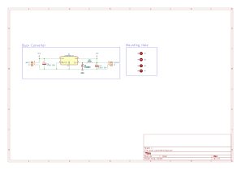
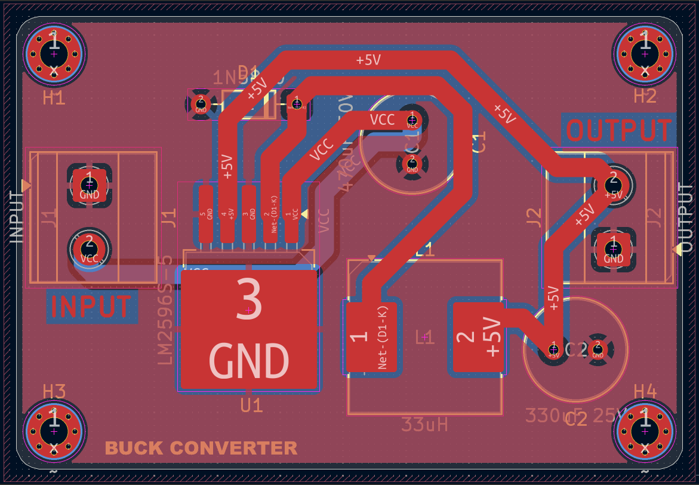

# Buck Converter

A step-down DC-DC converter that produces a lower output voltage from a higher input voltage, using a switch, inductor, diode, and capacitor.





## Overview

The buck converter is one of the most fundamental switch-mode power supply (SMPS) topologies. It steps down an input DC voltage to a lower, regulated output DC voltage by rapidly switching a transistor on and off and using an inductor-capacitor (LC) filter to smooth the output.

## Working Principle

1. **Switch ON:** The main switch (MOSFET) conducts, connecting the input voltage across the inductor. Current through the inductor rises, storing energy in its magnetic field. The output capacitor charges and supplies the load.
2. **Switch OFF:** The switch opens. The inductor's stored energy keeps current flowing through the load via the freewheeling diode, maintaining continuous current flow.
3. This ON/OFF cycle repeats at a fixed switching frequency, with the **duty cycle (D)** controlling how much of each cycle the switch stays on.

## Key Equations

**Output voltage (ideal, continuous conduction mode):**
```
Vout = D x Vin
```
where D = Ton / T (duty cycle), Ton = switch-on time, T = switching period.

**Inductor sizing (for continuous conduction mode):**
```
L = (Vin - Vout) x D / (f x ΔIL)
```
where f = switching frequency, ΔIL = desired inductor current ripple.

**Output capacitor sizing:**
```
C = ΔIL / (8 x f x ΔVout)
```
where ΔVout = desired output voltage ripple.

## Typical Applications

- Point-of-load (POL) regulation on PCBs (stepping 12V/5V rails down to 3.3V, 1.8V, etc.)
- Battery-powered devices needing efficient voltage step-down
- USB power delivery and charging circuits
- LED drivers

## Specifications (this design)

| Parameter | Value |
|---|---|
| Input Voltage | *fill in* |
| Output Voltage | *fill in* |
| Output Current | *fill in* |
| Switching Frequency | *fill in* |

## Pros & Cons

**Pros:**
- Simple topology, few components
- High efficiency (typically 85-95%)
- Well-understood, widely supported by IC controllers

**Cons:**
- Non-isolated (output shares ground reference with input)
- Requires careful inductor/capacitor selection to minimize ripple
- Switching noise requires good PCB layout practices (short high-current loops, proper decoupling)

## Files in This Folder

| File | Description |
|---|---|
| `buck-converter.kicad_pro` | KiCad project file |
| `buck-converter.kicad_sch` | Schematic source file |
| `buck-converter.kicad_pcb` | PCB layout source file |
| `buck-converter-PTH.drl` | Plated through-hole drill file |
| `buck-converter-NPTH.drl` | Non-plated through-hole drill file |
| `schematic.svg` | Schematic preview image |
| `pcb-layout.png` | PCB layout preview image |

## How to Use

1. Clone or download this repository.
2. Open `buck-converter.kicad_pro` in [KiCad](https://www.kicad.org/) (v7 or later recommended).
3. Modify component values in the schematic to suit your voltage/current requirements (see equations above).
4. Re-run the PCB layout if you change footprints, then re-export Gerbers for manufacturing.

## License

Schematics and PCB design files are licensed under [CERN-OHL-S-2.0](https://ohwr.org/cern_ohl_s_v2.txt). See the repository's `LICENSE-HARDWARE` file for details.
